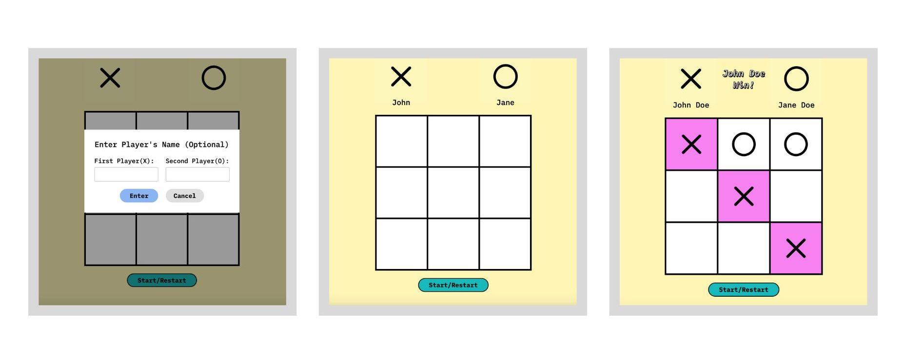

# odin-tic-tac-toe
## Odin Project: Tic Tac Toe

 
  

    
  

 

## Summary 
In this project, I used JavaScript, CSS, and HTML to construct a desktop-browser-based Tic-Tac-Toe game. The goal was to demonstrate what I had previously learned of JavaScript Factory Function, IIFE Module, Scope, and Closure. Details on the project are available [here](https://www.theodinproject.com/lessons/node-path-javascript-tic-tac-toe).

**Project Instructions**:
1. Initiate a game board using an array.
2. Store players within objects.
3. Use modules/factory functions for code encapsulation.
4. Integrate code logically.
5. Render X and O from game board to HTML.
6. Include a function to determine game status (winner or tie).
7. Implement start/reset button, player name input, and winner notification spot.

    **Optional (Not implemented)**: Create an AI for random moves, and then make it unbeatable.  

I've employed a combination of newly acquired and foundational skills throughout this project. Here's a breakdown:

  
Problem Solving

  - Recognizing problems
  - Strategic planning
  - Employing a divide and conquer approach
  

  
Error Correction

- Utilizing Chrome Developer Tools
- Conducting web searches for solutions 

  
Clean Code Writing

- Maintaining consistent indentation
- Adopting descriptive and consistent naming conventions
- Adhering to principles like YAGNI, DRY, and KISS 

  
HTML

- Crafting a basic form inside a modal
- Implementing client-side form validations

  
CSS

- (New) Employing `calc()`
- (New) Implementing `max()`
- (New) Styling SVGs to fit within grid cells
- Designing layouts using both Grid and Flexbox  
- Applying a CSS reset
- Integrating custom fonts
- Experimenting with font-related properties
- Implementing parent-child combinators
- Employing pseudo selectors
- Utilizing attribute selectors
- Prioritizing relative units 
- Defining and using custom properties
- Building modals

  
Javascript

- (New) Implementing Factory Functions
- (New) Leveraging IIFE Modals
- (New) Differentiating between `e.currentTarget` and `e.target` 
- (New) Prototyping in the console first 
- Implementing `e.preventDefault()`
- Making use of the ternary operator
- Utilizing objects 
- Distinguishing between function declarations and expressions  
- Grasping core concepts such as variables, numbers, operators, and various data types
- Understanding conditionals, methods, loops, and functions  

  
  
DOM Manipulation

- (New) Implementing `dataset`
- (New) Transferring data from HTML input to display
- Making use of template literals for DOM access
- Utilizing `classList.add` 
- Modifying styles and HTML content
- Incorporating event listeners

  
Emmet

- Using abbreviations for HTML coding
- Employing shortcut keys

  
SVG

- Incorporating SVG imagery 

 
    

### Resources Used 

- ['World's Best SVG Compressor' by vecta.io](https://vecta.io/nano);

- ['Pixelied.com'](https://pixelied.com/home);

- ['google-webfonts-helper' by Mario Ranftl](https://gwfh.mranftl.com/fonts)
 
- ['Figma' by Figma](https://www.figma.com/)

### Referenced Tutorials 

Javascript related:

- ['What are YAGNI, DRY and KISS principles in software development?' by educative.io](https://www.educative.io/answers/what-are-yagni-dry-and-kiss-principles-in-software-development);

- ['Alternative to if / else and switch: object literals in JavaScript' by Abdessamad Bensaad](https://dev.to/b3ns44d/alternative-to-if-else-and-switch-object-literals-in-javascript-3nde)

- ['Essential JavaScript: Mastering Immediately-invoked Function Expressions' by Chandra Gundamaraju](https://vvkchandra.medium.com/essential-javascript-mastering-immediately-invoked-function-expressions-67791338ddc6)

- ['JavaScript forEach() – JS Array For Each Loop Example' by freeCodeCamp](https://www.freecodecamp.org/news/javascript-foreach-js-array-for-each-example/)

- ['JavaScript Array indexOf()' by W3Schools](https://www.w3schools.com/jsref/jsref_indexof_array.asp)

- ['for...in' by MDN](https://developer.mozilla.org/en-US/docs/Web/JavaScript/Reference/Statements/for...in)

- ['for...of' by MDN](https://developer.mozilla.org/en-US/docs/Web/JavaScript/Reference/Statements/for...of)

- ['JavaScript String trim()' by JavaScript Tutorial](https://www.javascripttutorial.net/javascript-string-trim/)

- ['JavaScript Array find()' by W3Schools](https://www.w3schools.com/jsref/jsref_find.asp)

- ['HTMLElement: dataset property' by MDN](https://developer.mozilla.org/en-US/docs/Web/API/HTMLElement/dataset)

- ['Using data attributes' by MDN](https://developer.mozilla.org/en-US/docs/Learn/HTML/Howto/Use_data_attributes)

- ['How You Can Use HTML5 Custom Data Attributes and Why' by sitepoint](https://www.sitepoint.com/how-why-use-html5-custom-data-attributes/)

- [' Disable div on click & ways to add/remove eventListener' chatGPT-4(answered from my question)](https://chat.openai.com/share/a2fbca73-f570-476b-bb4e-cea7a7480754)

- ['How to ensure an event listener is only fired once in JavaScript' by educative](https://www.educative.io/answers/how-to-ensure-an-event-listener-is-only-fired-once-in-javascript)

- ['JavaScript Event Objects Tutorial' by Nick McCullum](https://www.nickmccullum.com/javascript/javascript-event-objects/#selecting-event-targets-using-javascript-event-objects)

- ['Refresh the Page in JavaScript – JS Reload Window Tutorial' by freeCodeCamp](https://www.freecodecamp.org/news/refresh-the-page-in-javascript-js-reload-window-tutorial/)

- ['min(), max(), and clamp(): three logical CSS functions to use today' by web.dev](https://web.dev/min-max-clamp/)

- ['Object-fit and background-size' by The Publishing Project](https://publishing-project.rivendellweb.net/object-fit-and-background-size/)

- ['overflow-wrap' by MDN](https://developer.mozilla.org/en-US/docs/Web/CSS/overflow-wrap)

- ['How To Create a Modal Box' by W3Schools](https://www.w3schools.com/howto/howto_css_modals.asp)

- ['How to transfer form input data like Prompt in JS' by chatGPT-4(answered from my question)](https://chat.openai.com/share/1650782d-626b-4af9-bccb-1b307184e5b8)

- ['How to select a element using data attribute in JavaScript' by Reactgo](https://reactgo.com/select-element-data-attribute-js/)

CSS related: 

- ['IBM Plex Sans Webfont · 3 samples' by Typ.io](https://typ.io/fonts/ibm_plex_sans)

- ['Totally Awesome ’80s Color Palettes (With Hex Codes) To Make Your Projects Pop' by Vandelay Design](https://www.vandelaydesign.com/80s-color-palettes/)

- ['The best 80s fonts on Canva for a groovy, retro design' by Fabrik](https://fabrikbrands.com/best-80s-fonts-on-canva-for-groovy-retro-design/)

- ['Adding Stroke to Web Text' by CSS-TRICKS](https://css-tricks.com/adding-stroke-to-web-text/)

- ['The text-shadow CSS Property' by  CHRISTINA TRUONG](https://1stwebdesigner.com/the-text-shadow-css-property/)
